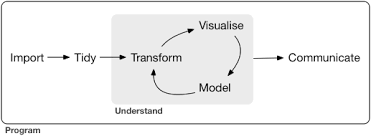

## Introdução

Parabéns, você já é capaz de importar dados, manipulá-los e retirar alguns insights de gráficos e tabelas. Contudo, vimos isso em aulas separadas e talvez você não se sinta confiante para realizar uma análise do começo ao fim. Nesta aula, o objetivo é justamente capacitá-la o ciclo de ciência de dados.

## Parte 1 - A pergunta

Toda análise é motivada por uma pergunta. Essa pergunta pode ter origem uma origem teórica, como normalmente vemos na academia, ou prática, como normalmente vemos em empresas. Independente da origem, uma vez que formulemos a pergunta, vamos para o processo de importar os dados para o nosso ambiente e estruturá-los.



Qual será o desafio de hoje? Eu quero que vocês imaginem como parte de um time de futebol e vocês são responsáveis por montar 


```r
library(tidyverse)
```


```r
data <- readr::read_csv('data/fifa19.zip')
```

[Estratégias no Futubol - Nexo](https://www.youtube.com/watch?v=FZ4Sb82myi0)

[Guia dos Atributos](https://pt.fifauteam.com/atributos-de-jogadores-fifa-18/)

## Como vamos atacar o problema?

Nesse exercício, vamos montar a seleção brasileira de futebol seguindo a formação 4 - 1 - 4 - 1 utilizada pelo Tite na Copa do Mundo de 2018. Isso significa que iremos precisar de 4 zagueiros, 1 volante, 2 meias, 2 pontas e 1 atacante. Agora, quais as habilidades necessárias em cada uma dessas posições?

- Goleiro: habilidades de goleiro (dããã)

- Defesa: habilidade de defesa (dããã)

- Volante: decisão, passes curtos e longos.

- Meias: finalização e passes curtos.

- Pontas: resistência, finalização com os pés e passes longos.

- Atacante: resistência, finalização com cabeça e com os pés.

A partir dessas habilidades podemos criar métricas para medir o quão bom um jogador é para uma determinada posição.

### Quais variáveis vamos utilizar?


```r
glimpse(data)
```

- Goleiro:

    + Variáveis: GKReflexes e GKPositioning.

- Defesa:

    + Variáveis: Marking e Interceptions.
    
- Volante:

    + Variáveis: LongPassing e Crossing.
    
- Meias:

    + Variáveis: ShortPassing e Finishing.
    
- Pontas:

    + Variáveis: Finishing, Crossing.
    
- Atacante:

    + Variáveis: Finishing, Volleys.
    
## Manipuando Dados

### Filtrando para Brasileiros


```r
data <- data %>% 
  filter(Nationality == 'Brazil')
```

### Criando nossas métricas:


```r
data <-  data %>% 
  mutate(metrica_goleiro = GKHandling * GKReflexes,
         metrica_defesa  = Marking * Interceptions,
         metrica_volante = LongPassing * Crossing,
         metrica_meia    = ShortPassing * Finishing,
         metrica_pontas  = Finishing * Crossing,
         metrica_atacante = Finishing * Volleys)
```

## Análise Exploratória


### Goleiros


```r
ggplot(data, mapping = aes(x = metrica_goleiro)) +
  geom_histogram()
```

Mas o que raios aconteceu? É de se esperar que nem todo jogador tenha habilidade de goleiro. Logo para ter uma noção da distribuição dos goleiros  nos limitar àqueles que jogam nessa posição.


```r
data %>% 
  filter(Position == 'GK') %>% 
  ggplot(data, mapping = aes(x = metrica_goleiro)) +
  geom_histogram()
```


```r
data %>% 
  ggplot(mapping = aes(x = GKReflexes, y = GKPositioning)) +
  geom_point()
```


```r
data %>% 
  select(Name, metrica_goleiro) %>% 
  arrange(desc(metrica_goleiro)) %>% 
  head(10)
```

### Zagueiros


```r
data %>% 
  ggplot(mapping = aes(x = Marking, y = Interceptions)) + 
  geom_point()
```


```r
ggplot(data, mapping = aes(x = metrica_defesa)) + 
  geom_histogram()
```


```r
data %>% 
  select(Name, metrica_defesa) %>% 
  arrange(desc(metrica_defesa)) %>% 
  head(10)
```

### Volantes


```r
data %>% 
  ggplot(mapping = aes(x = LongPassing, y = Crossing)) +
  geom_point()
```


```r
ggplot(data, mapping = aes(x = metrica_volante)) +
  geom_histogram()
```


```r
data %>% 
  select(Name, metrica_volante) %>% 
  arrange(desc(metrica_volante)) %>% 
  head(10)
```

### Meias


```r
data %>% 
  ggplot(mapping = aes(x = ShortPassing, y =  Finishing)) + 
  geom_point()
```


```r
ggplot(data, mapping = aes(x = metrica_meia)) +
  geom_histogram()
```


```r
data %>% 
  select(Name, metrica_meia) %>% 
  arrange(desc(metrica_meia)) %>% 
  head(10)
```

### Pontas


```r
data %>% 
  ggplot(mapping = aes(x = Finishing, y = Crossing)) + 
  geom_point()
```


```r
ggplot(data, mapping = aes(x = metrica_pontas)) +
  geom_histogram()
```


```r
data %>% 
  select(Name, metrica_pontas) %>% 
  arrange(desc(metrica_pontas)) %>% 
  head(10)
```

### Atacantes


```r
data %>% 
  ggplot(mapping = aes(x = Finishing, y = Volleys)) +
  geom_point()
```


```r
ggplot(data, mapping = aes(x = metrica_atacante)) +
  geom_histogram()
```


```r
data %>% 
  select(Name, metrica_atacante) %>% 
  arrange(desc(metrica_atacante)) %>% 
  head(10)
```

## Selecionando nossos Jogadores


```r
goleiro <- data %>%
  arrange(desc(metrica_goleiro)) %>% 
  head(1)

zagueiros <- data %>%
  arrange(desc(metrica_defesa)) %>% 
  head(4)

volante <- data %>%
  arrange(desc(metrica_volante)) %>% 
  head(1)
  
meias <- data %>%
  arrange(desc(metrica_meia)) %>% 
  head(2)
  
pontas <- data %>%
  arrange(desc(metrica_pontas)) %>% 
  head(2)
  
atacante <- data %>%
  arrange(desc(metrica_atacante)) %>% 
  head(1)


nosso_time <- goleiro %>% 
  bind_rows(zagueiros, 
            volante,
            meias,
            pontas,
            atacante)
```


```r
nosso_time %>% 
  select(Name)
```


